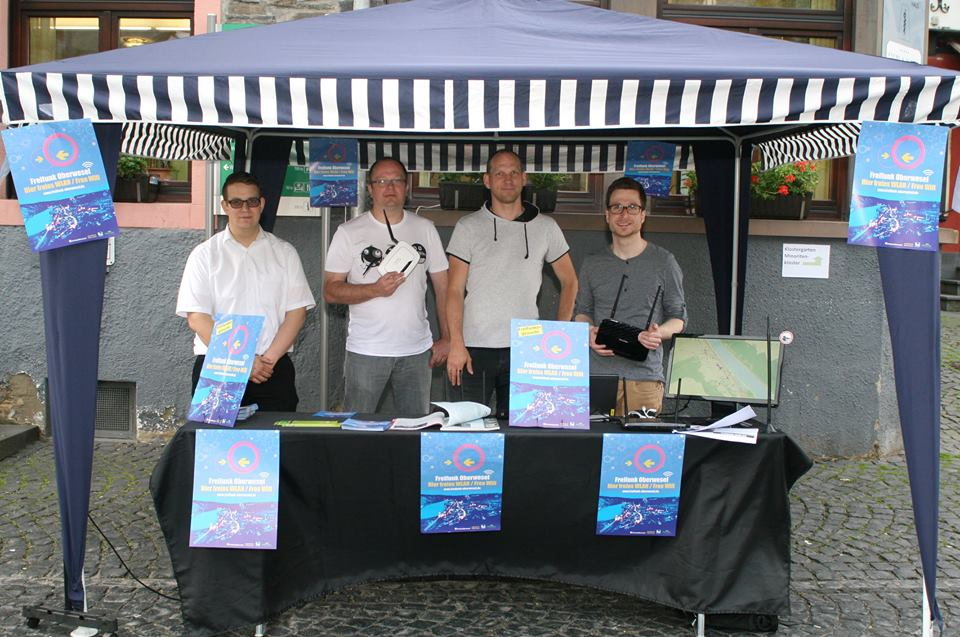

Am 2016-06-07 fand das monatliche Treffen der Freifunker im Closter Sudhaus in Koblenz statt. Mit urlaubsbedingt überschaubarer Teilnehmerzahl wurden die letzten Aktivitäten durchgesprochen und organisatorische Fragen geklärt.

Neben der Vorstellung der neuen Stable-Firmware und kurzer Diskussion zur Neuregelung der Störerhaftung berichtete Björn über das Stadtmauerfest in Oberwesel. Unter anderem wurde hier für die Veranstaltung der gesamte Marktplatz mit Freifunk ausgeleuchtet und ein Info-Stand aufgebaut. Ein Bericht mit weiteren Details und Statistiken wird in Kürze folgen.

Auch an anderer Stelle stand Freifunk-MYK in der Öffentlichkeit: Im Rahmen einer Wahlkampfveranstaltung besuchte die Obfrau des Bundestagsausschusses für Kultur und Medien, MdB Tabea Rößner (B90/Grüne), den Ort Virneburg. Das Treffen hatte explizit "Freifunk auf dem flachen Land" als Thema. Fr. Rößner ließ sich hierbei den Aufbau des lokalen Freifunk-Netzes detailliert erklären und zeigte großes Interesse.

Weiterhin ist geplant im August am Rheinland-Pfälzischem Ehrenamtstag in Mayen teilzunehmen und auch in diesem Rahmen Freifunk zu präsentieren.

Organisatorisch wurden viele Unklarheiten beseitigt, so wird das Moderationsteam unserer Mailinglisten verstärkt und die Fertigstellung der neuen Webseite vorangetrieben. Auch eine neue Serie von Informationsflyern und Aufklebern soll in naher Zukunft erstellt und in Druck gegeben werden.

Eine vollständige Themenliste ist wie üblich [in unserem Wiki](http://wiki.freifunk-myk.de/protokol/treffen_2016-06-07) zu finden. Themen für das nächste Treffen können [im Pad](https://pad.freifunk.net/p/ffmyk-treffen) vorgeschlagen werden.
