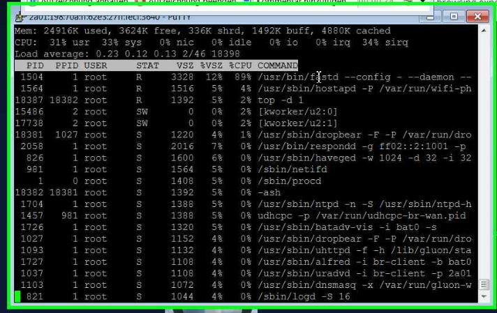
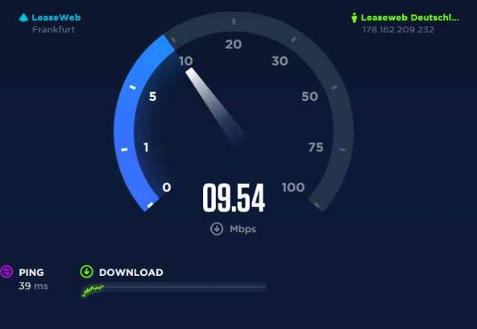
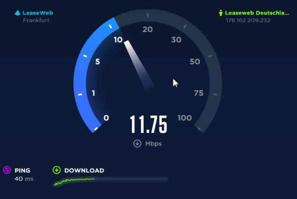
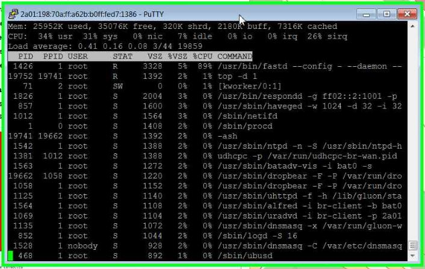
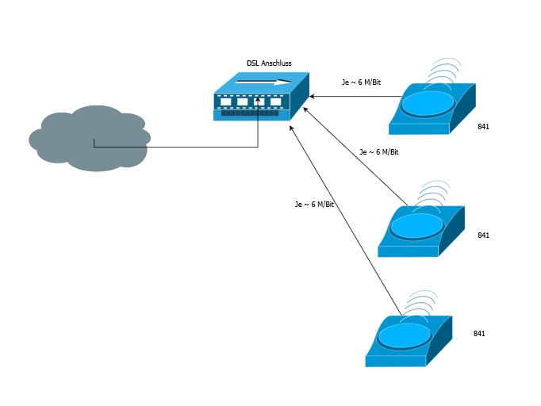
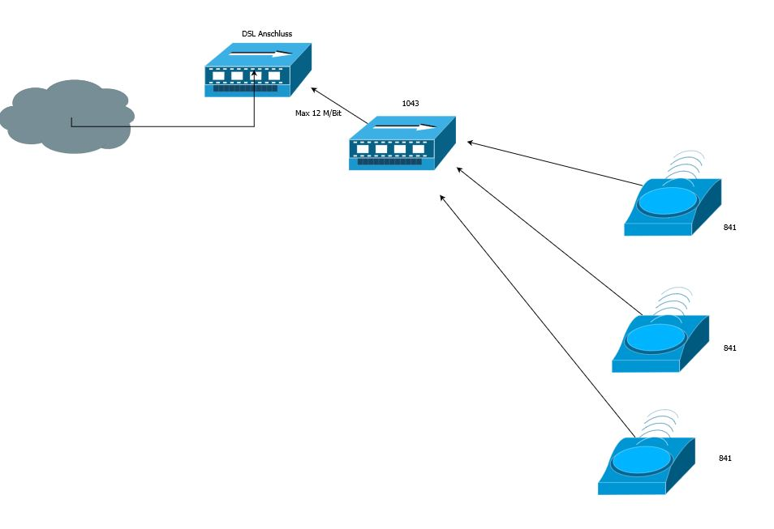

### 1043 Offloader vs 841

Infos aus [https://bremen.freifunk.net/blog/2016/02/16/performance-und-offloader.html](https://bremen.freifunk.net/blog/2016/02/16/performance-und-offloader.html)

Das größte Problem bei langsamen Freifunk sind schwachbrüstige Freifunk-Router. Die Hauptaufgabe des Freifunk-Routers ist der verschlüsselte Tunnel zu unseren Freifunk-Gateways. Für jedes Paket, dass der Router versendet und empfängt muss also zuvor eine mathematische Aufgabe (Verschlüsselung) gelöst werden. Das Einstiegsmodell für rund 20€ verfügt jedoch über einen schwachen Prozessor und wenig Speicher. Die Grundidee ist nun, den rechenintensiven Verschlüsselungs-Teil auf ein dediziertes Gerät auszulagern, dem sog. ‘Offloader’. Dadurch kann der normale Freifunkrouter entlastet und der Datendurchsatz erhöht werden.

Als Offloader eignen sich also alle Geräte mit mehr CPU Leistung. Im einfachsten Fall können die größeren TP-Link Modelle, wie der WDR3600 oder der WDR4300 genutzt werden. Ein [Benchmark](https://projects.universe-factory.net/projects/fastd/wiki/Benchmarks) vergleicht die vier bekanntesten Router zusammen mit verschiedenen Verschlüsselungsmethoden (dazu später mehr). Es zeigt sich, dass eine hochwertigerer Router oft 50% bis 100% mehr Durchsatz durch den verschlüsselten Tunnel bedeuten.

Wenn jedoch mehr als 30 bis 40 Mbit/s gefordert sind, ist mehr Hardware als ein WDR nötig. In den meisten Fällen wird zu stromsparenden kleinen x86-Rechnern gegriffen. Das sind normale PCs, die jeder bei sich unter dem Schreibtisch stehen hat (nur meist kleiner). Für diese bieten wir auch eine spezielle x86 [Firmware](http://downloads.bremen.freifunk.net/firmware/stable/factory/) an. Es kann also theoretisch jeder Computer mit beliebig vielen Netzwerkkarten und nicht all zu exotischer Hardware als Freifunk-Router genutzt werden. Das entscheidene Kriterium ist neben Rechenleistung dann schnell Strom- und Platzverbrauch.

### 1.0 Testumgebungen

Perfornmance Analyse Offloader 1043 V3 vs 841

Node am Anschluss von :

 - **AN1** Telekom Business 100Mbit ~ Up 102.000 down 99.000 (10,31 M/Bit down)
 - **AN2** Quix 75M ~ Up 75.000 down 10.000 (6,6 M/Bit down)
 - **AN3** 1&1 16.000 ~ Up 15.000 down 1.000 (1,1 M/Bit down)

Mehere Messungen über Tag verteilt

#### 1.1 Analyse Tools

Download Test mit

[http://www.speedtest.net/](http://www.speedtest.net/)

[http://speedof.me/](http://speedof.me/)

Um Traffice zu simulieren wurde jeweils große Dateien runtergeladen, sowie Streams (Youtube usw) verwendet.

[http://mirror1.hs-esslingen.de/pub/Mirrors/ftp.opensuse.org/distribution/12.3/iso/openSUSE-12.3-DVD-x86_64.iso](http://mirror1.hs-esslingen.de/pub/Mirrors/ftp.opensuse.org/distribution/12.3/iso/openSUSE-12.3-DVD-x86_64.iso)

[http://cdimage.debian.org/debian-cd/8.5.0/amd64/iso-dvd/debian-update-8.5.0-amd64-DVD-2.iso](http://cdimage.debian.org/debian-cd/8.5.0/amd64/iso-dvd/debian-update-8.5.0-amd64-DVD-2.iso)

und FTP

### 2.0 Performance 841

Gemessene Downloadgeschwidikeit

841 v10 am Anschluss **AN1**

Wie zu erwarten von Max 100 M/Bit warden im Schnitt 6-7 M/bit erreicht

Ursache CPU :

Jetzt ein Zweiter 841 v 11 am gleichen Anschluss **AN1**, jeder erreicht ca 6 M/bit

Fatzit des 841er : Mit einer 100.000er Leitung kann man locker 8-10 841 direkt anschließen um die maximale Barndbreite auszulasten.

### 3.0 Performance 1043

Gemessene Downloadgeschwidikeit. 1043 v 3 am Anschluss **AN1**

Wie zu erwarten bessere Performace.

Max an **AN2**

CPU

### **4.0** Offloader 1043 Sinvoll bei schnellen Anschlüssen ?

VS

