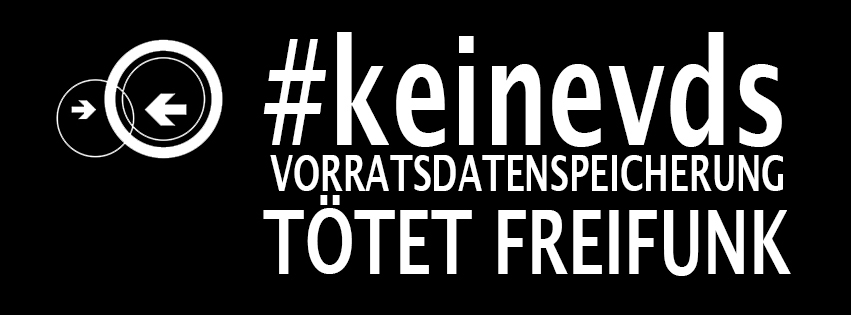

**Update 28.06.17:** Die Bundesnetzargentur hat die Vorratsdatenspeicherung vorerst ausgesetzt. **Freifunk-MYK schaltet deshalb keine Server zum 1. Juli ab**. [Hier die Mitteilung der Bundesnetzargentur.](https://www.bundesnetzagentur.de/DE/Sachgebiete/Telekommunikation/Unternehmen_Institutionen/Anbieterpflichten/OeffentlicheSicherheit/Umsetzung110TKG/VDS_113aTKG/VDS-node.html) Wir hoffen, dass die Hauptverhandlung ebenfalls zu unseren Gunsten ausfällt oder die Bundesnetzagentur bis zu diesem Zeitpunkt Freifunk-MYK von der Vorratsdatenspeicherung ausnimmt. Bis dahin funken wir weiter.

**Update 20.06.17**: Freifunk Rheinland e.V. hatte mit der Bundesnetzargentur einen Mailverkehr zu diesem Thema. Die entsprechenden Mails/Primärquellen sind angefragt. [Hier das Statement von Freifunk Rheinland e.V.](https://www.freifunk-rheinland.net/2017/06/19/vds-ab-juli-nicht-fuer-freifunk-und-den-ffrl/)

**Dieser Text ist nicht mehr aktuell. Siehe Update oben.**

Am 1. Juli 2017 kommt die Vorratsdatenspeicherung. Wir haben gestern auf unserem monatlichen Treffen darüber diskutiert und sind zum Entschluss gekommen, dass wir nach derzeitiger Gesetzeslage den Verkehr von Freifunk ins Internet abschalten müssen.

> Zum 1. Juli 2017 müssen “Erbringer öffentlich zugänglicher Telekommunikationsdienste” in Deutschland die wiedereingeführte Vorratsdatenspeicherung umsetzen. Dies bedeutet, dass Kommunikationsdaten („wer hat wann mit wem kommuniziert“) aller Teilnehmer ihres Netzes gespeichert werden müssen. Hierfür gelten besondere Bedingungen, wie zum Beispiel eine räumlich getrennte, sichere Speicherung der anfallenden Daten. Dies ist für die ehrenamtliche Initiative Freifunk organisatorisch, personell und finanziell nicht leistbar. Gleichzeitig widerspricht die anlasslose Speicherung der Kommunikationsdaten unserem Selbstverständnis. Wir halten die Vorratsdatenspeicherung, wie das Bundesverfassungsgericht auch schon am 2. März 2010 zur ersten Einführung der Vorratsdatenspeicherung von 2008 festgestellt hat, für grundgesetzwidrig.
> 
> Freifunk Münsterland, 31. Januar 2017
> 
> https://freifunk-muensterland.de/vorratsdatenspeicherung-koennte-aus-fuer-freifunk-bedeuten/

Es handelt sich dabei um § 113a (1) TKG, wonach wir als öffentlich zugänglicher Telekommunikationsdienst von der Vorratsdatenspeicherung nicht ausgenommen sind.

> (1) Die Verpflichtungen zur Speicherung von Verkehrsdaten, zur Verwendung der Daten und zur Datensicherheit nach den §§ 113b bis 113g beziehen sich auf Erbringer öffentlich zugänglicher Telekommunikationsdienste für Endnutzer. (...)
> 
> § 113a TKG, 12. Juni 2017
> 
> https://dejure.org/gesetze/TKG/113a.html

Es gibt derzeit zwar ein Statement wonach Freifunk von der Vorratsdatenspeicherung ausgenommen sei, dieses ist aber nur ein "Positionspapier" und nicht rechtlich verbindlich.

> Alles andere sind lediglich Kommentare zum Gesetz, welche für Gerichte nicht bindend sind.
> 
> einer unserer Serverbetreiber, 07. Juni 2017
> 
> Mailingliste Freifunk-MYK

Unsere Serverbetreiber, über der die Knoten ihre Daten ins Internet verschicken, wollen hier verständlicherweise kein Risiko eingehen "auf 50.000 € verklagt zu werden" und werden die Server zum 1. Juli 2017 offline nehmen.

Es laufen derzeit Verfassungsbeschwerden und Klagen gegen die Vorratsdatenspeicherung. Auch der Europäische Gerichtshof hat die Vorratsdatenspeicherung für rechtswidrig erklärt.

> Die Mitgliedstaaten dürfen den Betreibern elektronischer Kommunikationsdienste keine allgemeine Verpflichtung zur Vorratsdatenspeicherung auferlegen
> 
> Gerichtshof der Europäischen Union, 21. Dezember 2016
> 
> https://curia.europa.eu/jcms/upload/docs/application/pdf/2016-12/cp160145de.pdf

Dass die deutsche Vorratsdatenspeicherung auch vom Urteil betroffen ist, stellte im Februar der Wissenschaftliche Dienst des Bundestages fest:

> Der Wissenschaftliche Dienst des Bundestages kommt in einem von der Linksfraktion in Auftrag gegebenen Gutachten zu dem Ergebnis, dass das am 16. Oktober 2015 vom Bundestag beschlossene Gesetz zur Vorratsdatenspeicherung nicht den Vorgaben des Europäischen Gerichtshofes entspricht.
> 
> Mitteldeutsche Zeitung, 02. Februar 2017
> 
> http://www.mz-web.de/25672636

Nach fast 5 Monaten prüft die Regierung noch, welche Auswirkungen dieses Urteil hat.

> Die Prüfung, welche Schlussfolgerungen aus dem EuGH-Urteil vom 21. Dezember 2016 zu ziehen sind, ist derzeit noch nicht abgeschlossen.
> 
> Justizministerium, 4. Mai 2017
> 
> http://dipbt.bundestag.de/dip21/btd/18/122/1812229.pdf

Wir haben viel Zeit, Schweiß und Geld in Freifunk-MYK gesteckt. Wir lassen Freifunk nicht so einfach sterben. Im besten Fall sind wir ein paar Monate offline bis das Verfassungsgericht auch diese Vorratsdatenspeicherung für illegal erklärt oder die Bundesnetzagentur Freifunk von der Vorratsdatenspeicherung ausnimmt.

Wir hoffen auf euer Verständnis.

EDIT 12.06.17: Text aus § 113a hinzugefügt. Aussage F.K. hinzugefügt

