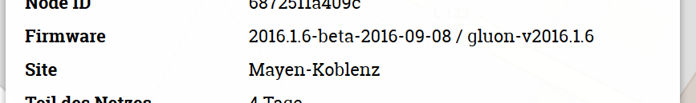

Nachdem es im Sommer 2017 zu mehreren Ausfällen auf Grund der Netzgröße gekommen war hatten wir einige einschneidende Umstellungen vorgenommen. Aktuell betrieben wir daher gleich zwei Infrastrukturen: Eine für das aktuelle Netz und eine weitere um alte Router weiter online zu halten. Nach nun mehr als 6 Monaten werden wir, wie mehrfach angekündigt, das alte Netz auslaufen lassen. Ab dem 29.02. wird die verfügbare Leistung auslaufen lassen - Router mit alter Firmware werden daher nur noch beschränkte Bandbreiten liefern und mittelfristig Ihre Funktion verlieren.

**Bin ich betroffen?**

Den einfachsten Weg das herauszufinden dürfte [unsere Karte](https://map.freifunk-myk.de) sein. Suche deinen Router, klicke ihn an und suche nach den Eintrag "Site". Steht dieser auf "Mayen-Koblenz" ist dein Router veraltet und somit betroffen.

**Was jetzt?**

Aktualisieren. Lade die [aktuelle Firmware](https://firmware.freifunk-myk.de) herunter, versetze deinen Router in den Konfigurationsmodus und lade die neue Datei hoch. Eine Anleitung findest du auf [unserer Seite](https://wiki.freifunk-myk.de/router_aktualisieren). Gerne helfen wir auch über unsere [Mailingliste](http://lists.freifunk.net/mailman/listinfo/mayen-koblenz-freifunk.net) oder bei den monatlichen Treffen.

**Muss das sein?**

Generell: Ja, Aktualisierungen sollten immer an allen Geräten zeitnah installiert werden. Nicht nur kannst du so Störungen durch Netzänderungen vermeiden, neuere Versionen enthalten auch Sicherheitsupdates, welche bekanntgewordene Angriffspunkte für Viren und Kriminelle schließen.

Die neue Firmware hat eine neue Option: In den "Experteneinstellungen" des Konfigurationsmodus lässt sich eine automatische Aktualisierung einschalten. Ist dieser aktiv werden neue Firmwareversionen zukünftig automatisch installiert, wenn diese von mehreren FFMYK-Firmwaremenschen als funktionierend markiert wurde. So musst du zukünftig nicht mehr selbst die Aktualisierungen einspielen. Beachte jedoch, dass die Installation in diesem Fall nicht gesteuert werden kann, es also jederzeit zu aktualisierungsbedingten Neustarts und Problemen im Zusammenspiel mit komplexeren Netzen kommen kann.
