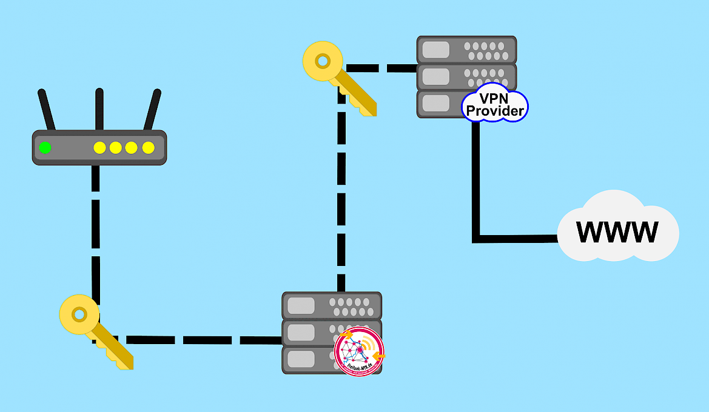

Vor ca. 3 Wochen haben wir nun auch den letzten Austrittspunkt des neuen Netzes auf die Systeme des [Freifunk Rheinland e.V.](https://www.freifunk-rheinland.net/) umgestellt. Durch diese Umstellung hat das Netz nicht nur an Geschwindigkeit und Stabilität gewonnen, es lassen sich nun auch Deutsche Mediatheken wie ZDF oder ARD Mediathek über das Freifunknetz verwenden. Wieso das nun funktioniert, was das nun genau bedeutet und wer überhaupt Freifunk-Rheinland ist, möchte ich in diesem Blogbeitrag erläutern.

## Nodes, Supernodes und VPN-Provider

Wer schon länger dabei ist weiß sicherlich über unsere Infrastruktur Bescheid. Für alle Anderen möchte ich es hier noch einmal kurz erläutern. Um das Problem der Störerhaftung zu umgehen setzen wir bei Freifunk-MYK, wie viele andere Communities, auf einen ganz bestimmten Netzaufbau. Dazu verbindet sich der Node (der Router bei dir zu Hause) mit einem unserer Supernodes (ein Server im Rechenzentrum). Von den Supernodes aus werden dann alle Anfragen verarbeitet. Die Anfragen, die ins Internet gehen, wurden bisher über einen VPN Anbieter, meist im näheren Ausland, getätigt. Dazu hat der Supernode die Anfragen zum Server eines VPN-Providers gesendet, welcher dei Anfrage beim geforderten Dienst stellt. Auf dem selben Weg kommen die Antworten zurück zum Smartphone, Laptop oder PC (siehe Infografik). Bei Freifunk-MYK haben wir beim VPN-Provider bisher [Mullvad](https://mullvad.net/de/) eingesetzt und meist Server in Schweden oder den Niederlanden verwendet. Diese Länder haben, wie fast alle anderen auch, keine Störerhaftung. Hinzu kommt, dass ein solcher Anbieter sich einfacher auf das "Providerprivileg" berufen kann, welches alle Anbieter - theoretisch auch private - von der Störerhaftung ausschließt. Leider ist die Geschwindigkeit, die diese Provider bieten, nicht sehr schnell und die Latenz (die Zeit, die es dauert, bis die Antwort auf eine Anfrage ankommt) ist vergleichsweise hoch.

## Zugang nun in Deutschland

Freifunk-Rheinland e.V. ist ein freier Verbund lokaler Freifunk-Gemeinschaften und Einzelpersonen. 2011 Gegründet umfasst er heute 360 Mitglieder (stand 31.12.2018). Seit September 2014 ist Freifunk-Rheinland e.V. [RIPE-Mitglied](https://www.ripe.net/membership/indices/DE.html) und hat somit offiziell den Provider Status. Die betrieben Server befinden sich in Deutschland und bieten somit einen für uns perfekten Zugangspunkt zum Internet.

Freifunk-Rheinland e.V. ersetzt also den VPN-Provider und bietet uns damit etliche Vorteile. Da sich der Zugangspunkt in Deutschland befindet ist es nun möglich viele deutsche Dienste mit Geoblocking über das Freifunk-MYK Netzwerk aufzurufen. Natürlich kostet diese Infrastruktur auch Geld (RIPE-Mitgliedschaft, Server, etc.) und dazu auch Manpower, weswegen wir alle dazu aufrufen möchten den Freifunk-Rheinland e.V. durch [Spenden](https://www.freifunk-rheinland.net/mitmachen/spenden/) oder einer [Mitgliedschaft](https://www.freifunk-rheinland.net/mitglied-werden/) passiv oder [aktiv zu unterstützen](https://www.freifunk-rheinland.net/mitmachen/).

Die Unterstützung des Freifunk-Rheinland e.V. kommt auch Freifunk-MYK und Allen, die unser Netzwerk verwenden, zugute. Da Freifunk-MYK kein eingetragener Verein ist, bitten wir daher Geldspenden an Freifunk-Rheinland e.V. zu richten.
